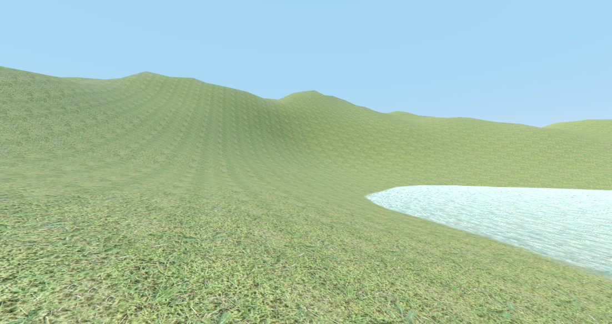
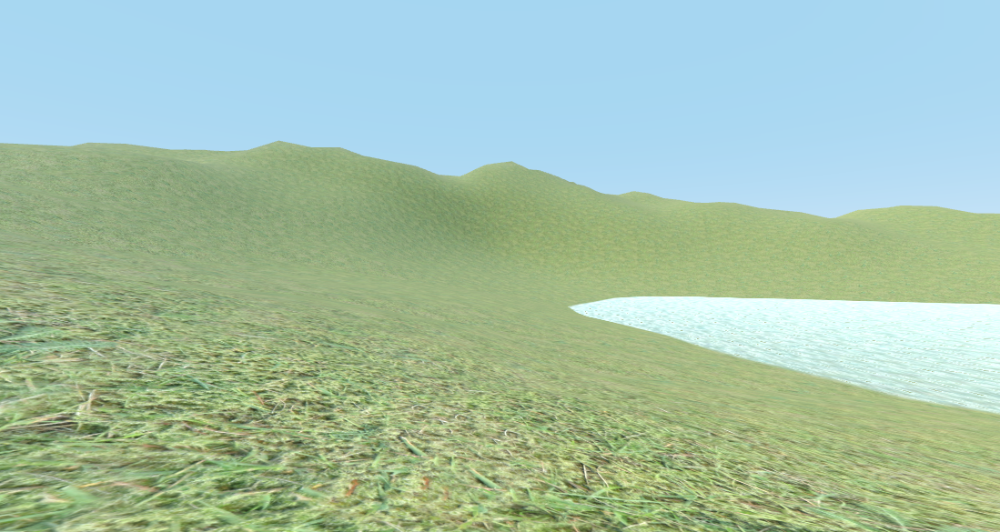
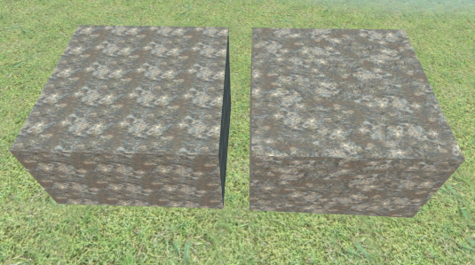
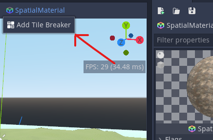
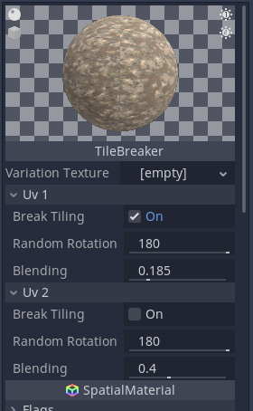
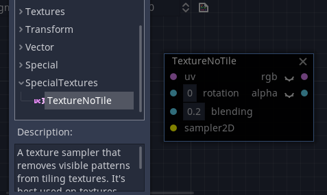

# Tile Breaker Plugin

Hello fellow Godot users! Have you ever come across this problem before?

Ugh! 😫 Look at all of that distracting tiling pattern in the terrain. Unless you're making a world of quilt, I doubt that you want this showing in your scenery. Well fear not! With this plugin, you'll be able to turn _that_, into _this_!

_Much_ better. 😄 Here's a side by side comparison of this feature. Amazing, isn't it?

## Installation

After downloading this repository, take the folder inside the `addons` folder, and put it into _your_ project's `addons` folder. Don't have one? Make one. After that, you enable the plugin in the `ProjectSettings` in the `Plugin` section. It's that easy.

## Instructions

This plugin currently is supported for `SpatialMaterials` and `ShaderMaterials` that use a `VisualShader`. 

### Materials

For `SpatialMaterials`, just select the material, press the `SpatialMaterial` button that shows up in the 3D editor, then press `Add Tile Breaker`. You remove the feature from the material the same way you add it.

Once you add the tile breaker, the `SpatialMaterial` will have new options.

* `Variation Texture` :- A texture used by the shader to randomize the offset patterns. _This option only appears when the plugin quality is set to `Low`._
* `Break Tiling` :- Whether to enable tile breaking for a certain UV layer.
* `Random Rotation` :- How much the texture is randomly rotated for a certain UV layer.
* `Blending` :- How much texture samples are blended with each other for a certain UV layer. No blending will cause seams to show up in the material, unless the plugin quality is set to `High`.

As for visual shaders, a custom visual shader node has been created for them.

The parameters act the same way they do in `SpatialMaterials`. One thing to note however. If the plugin quality is set to `Low`, then you have to set the variation texture uniform manually. You can find the default variation texture in the plugin's folder.

### Tile Breaker Quality

I've been talking about plugin quality for a while now. You will find that in the `ProjectSettings` under `Rendering -> Quality`. A low quality uses only 2 texture samples, medium uses 4, and high uses 8. As expected, each one looks better, but also is more performance heavy. If you have any `VisualShaders` that use the tile breaker, then you'll have to restart the project when you have set your desired quality.

### GLES 2 and 3

This plugin is best suited for projects running GLES 3, but it can run on GLES 2 just fine. There's just one problem. Artifacts will start showing up in that version. The only way to get rid of said artifacts is by disabling mipmapping for the texture being used. It's a trade-off you'll have to think about. 🤔

## Special Thanks

The textures used in the demo scene were provided by https://www.cgbookcase.com/. 🙂